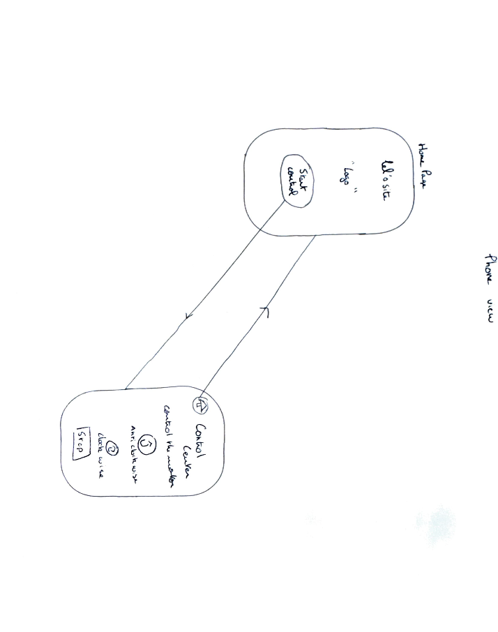
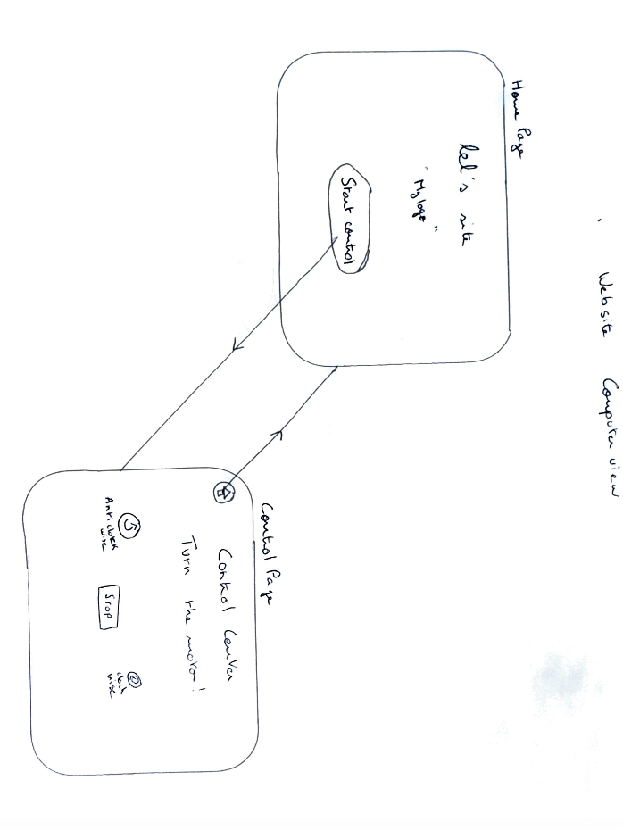

# CS_week41-git

This project consist of a website creation in order to control a microcontroller via WebSockets.
We needed 2 outputs and 1 inputs. 

Here is the list of the element you need to do the same as me :
- esp8266
- DC motor
- 2 kohm resistor
- 4.7 kohm resistor
- 100 ohm resistor
- led
- 1 nF condensator
- 2N2222 NPN transistor
- DS18B20 (thermometer)

My ESP8266 allow the control of the motor and the led, and read the data from the thermometer.

Please see the picture of the circuit:   
  

 
  
    
  

For my site I wanted something simple so that what I have imagined:   
    
  

  
  
  

Please find here the link of my figma file with graphic chart, site map and site idealisation.
  
[Figma](https://www.figma.com/design/Lt0ygBrPFi1SfbUWPDrDdS/webworkshop_cs_wk41?node-id=0-1&t=xhVR3v7xTgCsAmBN-1)

Please find here the video with the final version (:, link to youtube !   
[Watch the video](https://youtu.be/f8r0Wz3r05c)

